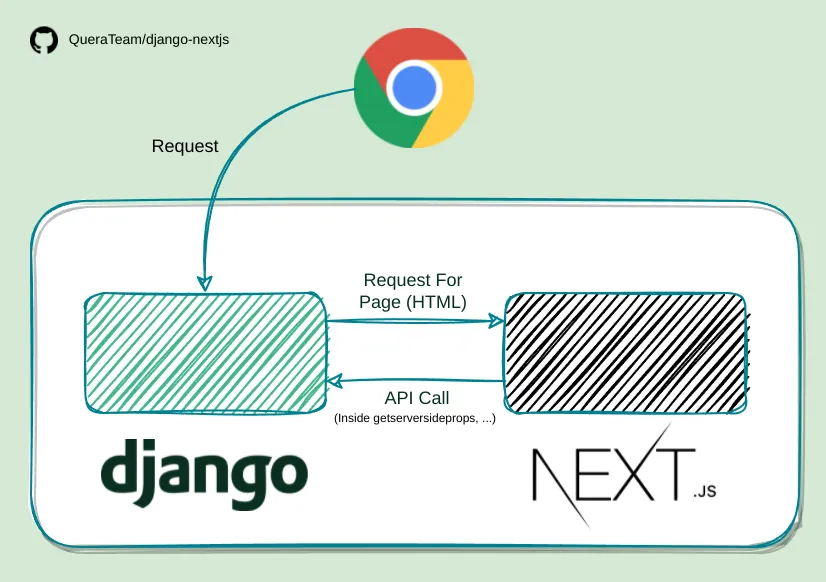
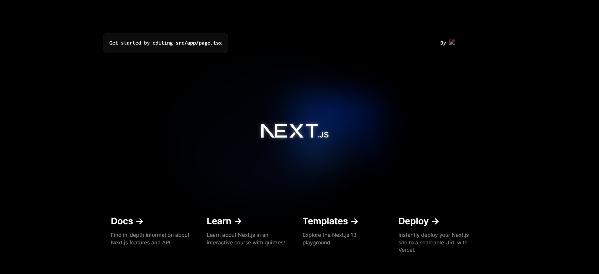

# Django + Next.js Project Building

We are going to combine Django and Next.js servers, use **Django to accept web requests** and use **Next.js as an internal service** that generates the HTML.

Sources:

- [(Github) QueraTeam/django-nextjs](https://github.com/QueraTeam/django-nextjs)
- [(Medium) Django + Next.js The Easy Way](https://medium.com/@danialkeimasi/django-next-js-the-easy-way-655efb6d28e1)

## Architecture

**Development Environment**

When you run the project with `./manage.py runserver`, you are using Django as a proxy for all the requests between you and Next.js.



**Production Environment**

In production, you should proxy some Next.js requests (requests that require no Django manipulation) through your webserver to reduce unnecessary loads on the Django server.


## Installation

### Dependencies Package

Required Version

- Django 4.0.0
- django-nextjs 2.4.0
- channels 3.0.4

```bash
pip install -r requirements.txt
```

### Create Django project and app

Django project name `django-nextjs-blog`

```bash
django-admin startproject 'django-nextjs-blog'
```

Django app name `django_app`

```bash
cd 'django-nextjs-blog'
python manage.py startapp 'django_app'

md static
md templates
```

### Create Nextjs project

Nextjs project name `nextjs_app`

```bash
npx create-next-app
npm run dev
```

The Next.js is up on **port 3000**.



## Django Setting

### Under Project

#### `setting.py`

1. Add apps and requirements to `INSTALLED_APPS`.

```python
INSTALLED_APPS = [
    "django_app",
    "channels",
    "nextjs_app",
    ...
]
```

2. Set the debug mode and allowed hosts.

```python
DEBUG = True

ALLOWED_HOSTS = ['*']
```

3. Set the `templates` directory path.

```python
import os
TEMPLATES = [
    {
        ...
        "DIRS": [os.path.join(BASE_DIR, "templates")],
        ...
    },
]
```

4. Use ASGI instead of WSGI.

```python
# WSGI_APPLICATION = "django_nextjs_blog.wsgi.application"
ASGI_APPLICATION = "django_nextjs_blog.asgi.application"
```

5. Set the time zone.

```python
LANGUAGE_CODE = "zh-hant"

TIME_ZONE = "UTC"
```

6. Set the `static` directory path.

```python
STATIC_URL = "static/"
STATICFILES_DIRS = [os.path.join(BASE_DIR, 'static')]
```

7. Initialized the database.

```bash
python manage.py makemigrations
python manage.py migrate
```

#### `urls.py`

Include the `django-nextjs` URLs inside **project** `urls.py`

```python
# django_nextjs_blog/urls.py

from django.contrib import admin
from django.urls import include, path

urlpatterns = [
    path("admin/", admin.site.urls),
    path("", include("django_app.urls")),
]
```

#### `asgi.py`

Set Django as ASGI server.

```python
import os

from django.core.asgi import get_asgi_application
from django.urls import re_path, path

os.environ.setdefault("DJANGO_SETTINGS_MODULE", "django_nextjs_blog.settings")
django_asgi_app = get_asgi_application()

from channels.auth import AuthMiddlewareStack
from channels.routing import ProtocolTypeRouter, URLRouter
from django_nextjs.proxy import NextJSProxyHttpConsumer, NextJSProxyWebsocketConsumer

from django.conf import settings

# put your custom routes here if you need
http_routes = [re_path(r"", django_asgi_app)]
websocket_routers = []

if settings.DEBUG:
    http_routes.insert(0, re_path(r"^(?:_next|__next|next).*", NextJSProxyHttpConsumer.as_asgi()))
    websocket_routers.insert(0, path("_next/webpack-hmr", NextJSProxyWebsocketConsumer.as_asgi()))


application = ProtocolTypeRouter(
    {
        # Django's ASGI application to handle traditional HTTP and websocket requests.
        "http": URLRouter(http_routes),
        "websocket": AuthMiddlewareStack(URLRouter(websocket_routers)),
        # ...
    }
)
```

### Under App

#### `views.py`

```python
from django.http import HttpResponse
from django_nextjs.render import render_nextjs_page

async def index(request):
    return await render_nextjs_page(request)
```

#### `urls.py`

**create** `urls.py` under app's folder

```python
# django_app/urls.py

from django.urls import path
from .views import index
urlpatterns = [
    path("", index, name="index"),
]
```

## Make it work

Nextjs frontend

```bash
# terminal_1
npm run dev
```

Django server

```bash
# terminal_2
python manage.py runserver
```

Now you can see `Nextjs` running on `Django server` **port 8000**.